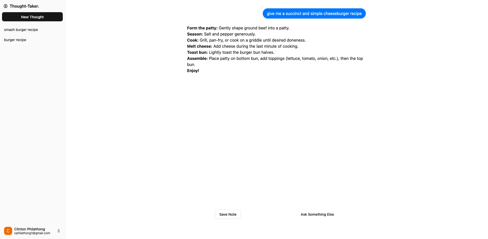

<h1 align="center">
  <a href="https://llm-thought-taker-frontend.vercel.app/">
    LLM-Thought-Taker
  </a>
</h1>

<h4>
An app that allows users to save answers to curious thoughts they may have, powered by Gemini Large Language Models. A Next.js frontend and .NET backend, deployed via an automated CI/CD pipeline using GitHub Actions and Azure infrastructure provisioned by Terraform and containerized with Docker.
</h4>

  

## Architecture

This projects follows a client-server architecture with apis written on a .NET backend deployed on Azure utilising Clerk to handle Authentication.

- **The frontend:** Built with React and Next.js and responsible for all the interations and client-side logic.
- **The backend:** .NET backend app deployed via ci/cd to Azure Web App for Containers via github actions and terraform provisioning.
