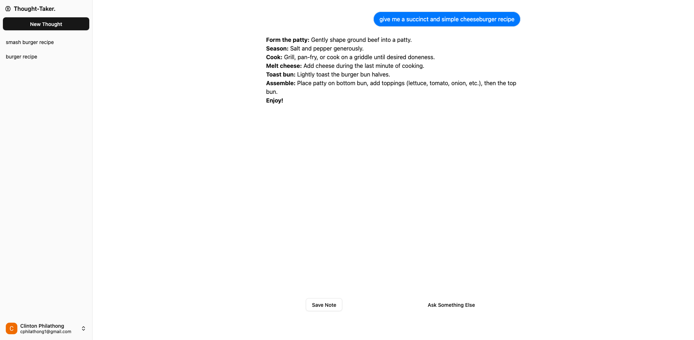

<h1 align="center">
  <a href="https://llm-thought-taker-frontend.vercel.app/">
    LLM Thought-Taker
  </a>
</h1>

<h4>
An app that allows users to save answers to curious thoughts they may have, powered by Large Language Models. Identical REST apis built with .NET on Azure and Node.js on AWS.
</h4>

  

## Architecture

This projects follows a client-server architecture with identical apis on a .NET backend deployed on Azure and a Node.js backend deployed on AWS. Utilising Clerk to handle Authentication.

- **The frontend (this repository):** Built with React and Next.js and responsible for all the interations and client-side logic.
- **The backend:** Deployed on AWS and/or Azure behind eachother's respective equivalent for API gateway and serverless functions for compute.

🔗 Check out the backend repositories for this project:

.NET (on azure): <a href="https://github.com/clinnyp/llm-thought-taker-backend.dotnet">llm-thought-taker-backend.dotnet</a>

Node.js (on aws): <a href="https://github.com/clinnyp/llm-thought-taker-backend.nodejs">llm-thought-taker-backend.nodejs</a>
